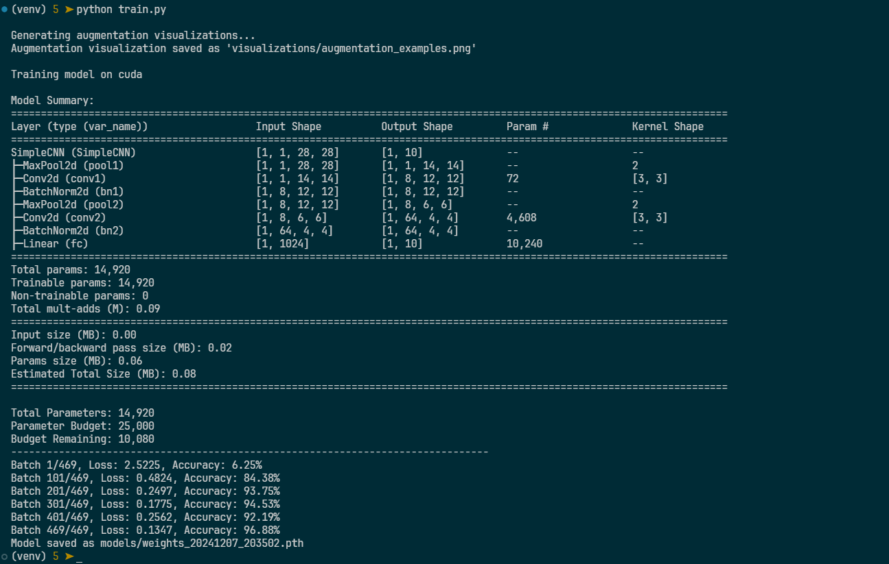
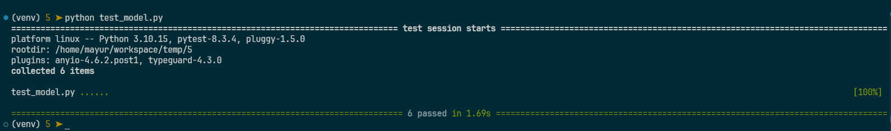
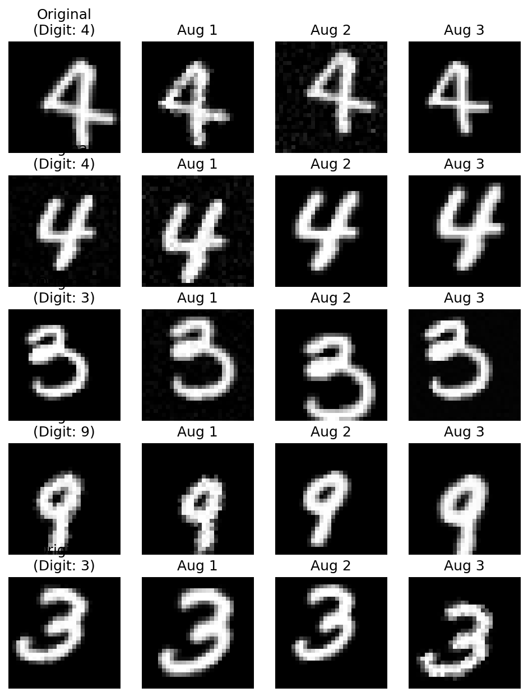
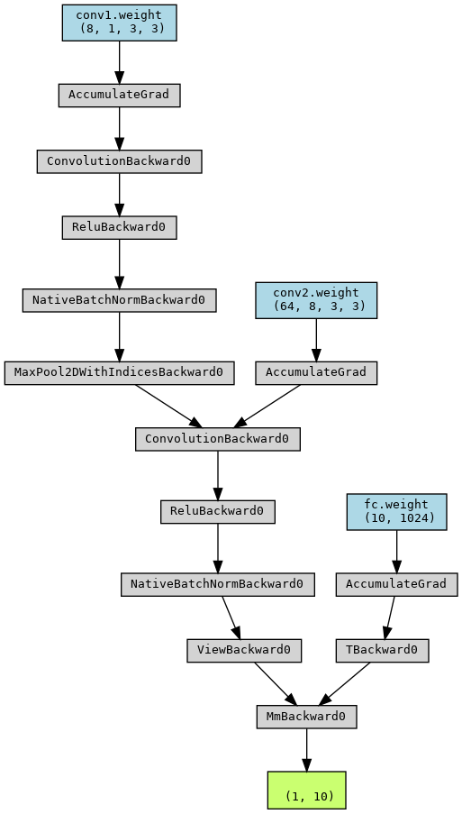

# MNIST Classification with CI/CD Pipeline

This project implements a lightweight CNN for MNIST digit classification with a complete CI/CD pipeline using GitHub Actions. The focus is on parameter efficiency and reproducibility.

## Project Structure
```
.
├── model.py          # Model architecture definitions
├── train.py         # Training script with visualization
├── test_model.py    # Comprehensive model testing
├── augment.py       # Custom MNIST dataset with augmentations
├── visualize_augment.py  # Augmentation visualization utilities
├── requirements.txt  # Project dependencies
└── .github/workflows/ml-pipeline.yml  # CI/CD configuration
```

## Model Architecture
SimpleCNN with parameter-efficient design:
- Input: [batch_size, 1, 28, 28]
- MaxPool2d → [batch_size, 1, 14, 14]
- Conv1 (8 filters, 3x3, no bias) → [batch_size, 8, 12, 12]
- BatchNorm2d (no affine) + ReLU
- MaxPool2d → [batch_size, 8, 6, 6]
- Conv2 (64 filters, 3x3, no bias) → [batch_size, 64, 4, 4]
- BatchNorm2d (no affine) + ReLU
- Flatten → [batch_size, 64 * 16]
- Linear (no bias) → [batch_size, 10]


```
Model Summary:
========================================================================================================================
Layer (type (var_name))                  Input Shape          Output Shape         Param #              Kernel Shape
========================================================================================================================
SimpleCNN (SimpleCNN)                    [1, 1, 28, 28]       [1, 10]              --                   --
├─MaxPool2d (pool1)                      [1, 1, 28, 28]       [1, 1, 14, 14]       --                   2
├─Conv2d (conv1)                         [1, 1, 14, 14]       [1, 8, 12, 12]       72                   [3, 3]
├─BatchNorm2d (bn1)                      [1, 8, 12, 12]       [1, 8, 12, 12]       --                   --
├─MaxPool2d (pool2)                      [1, 8, 12, 12]       [1, 8, 6, 6]         --                   2
├─Conv2d (conv2)                         [1, 8, 6, 6]         [1, 64, 4, 4]        4,608                [3, 3]
├─BatchNorm2d (bn2)                      [1, 64, 4, 4]        [1, 64, 4, 4]        --                   --
├─Linear (fc)                            [1, 1024]            [1, 10]              10,240               --
========================================================================================================================
Total params: 14,920
Trainable params: 14,920
Non-trainable params: 0
Total mult-adds (M): 0.09
========================================================================================================================
Input size (MB): 0.00
Forward/backward pass size (MB): 0.02
Params size (MB): 0.06
Estimated Total Size (MB): 0.08
========================================================================================================================

Total Parameters: 14,920
Parameter Budget: 25,000
Budget Remaining: 10,080
--------------------------------------------------------------------------------
```

## Features
- Parameter-efficient design (no bias terms)
- Non-parametric batch normalization
- Deterministic training with fixed seeds
- MNIST-specific data augmentations:
  - Rotation (-15° to 15°)
  - Scale (0.9 to 1.1)
  - Translation (±10%)
  - Elastic deformations
  - Contrast adjustments
  - Gaussian noise

## Installation
```bash
# Create virtual environment
python -m venv venv
source venv/bin/activate  # or `venv\Scripts\activate` on Windows

# Install dependencies
pip install -r requirements.txt
```

## Usage
```bash
# Train model and generate visualizations
python train.py

# Run tests
pytest test_model.py -v
```

## Model Testing
Comprehensive test suite verifies:
1. Architecture compatibility
   - Input/output shapes
   - Parameter count (<25,000)
   - Batch processing capability
2. Training behavior
   - Output range validation
   - NaN/Inf checking
   - Noise robustness
3. Performance metrics
   - Accuracy >95% on test set
   - Prediction distribution
   - Class balance

## CI/CD Pipeline
GitHub Actions workflow:
1. Sets up Python 3.8 environment
2. Installs dependencies
3. Trains model for one epoch
4. Runs comprehensive tests
5. Archives trained model as artifact

## Reproducibility
- Fixed random seeds for:
  - PyTorch operations
  - NumPy operations
  - Data augmentation
  - DataLoader shuffling
- Deterministic CUDNN settings
- Single-worker data loading

## Model Artifacts
- Weights saved with timestamps: `models/weights_YYYYMMDD_HHMMSS.pth`
- Architecture visualization: `visualizations/architecture.png`
- Augmentation examples: `visualizations/augmentation_examples.png`

## Requirements
See `requirements.txt` for full list

## Screenshots

> python train.py



> python test_model.py



### Image augmentation



### Model architecture



